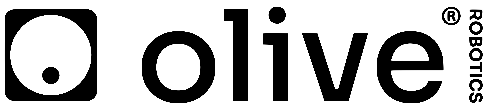

<h1 align="center">

ROS2 Interfaces
</h1>

The `olive-ros2-interfaces` repository installs the `olive-interfaces` ROS2 package which defines the custom topics, services, and actions used by different product from olive.